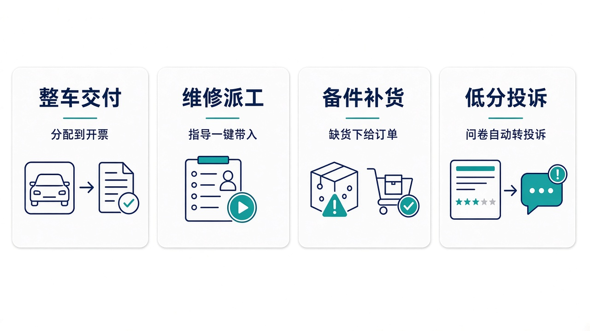
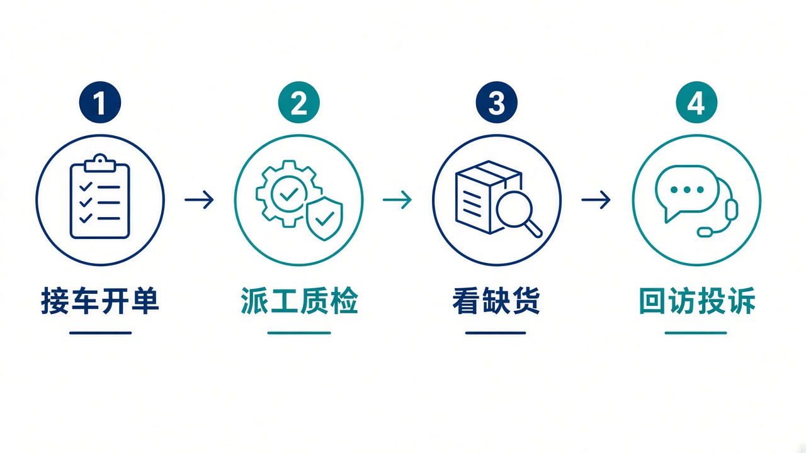

# 给大家讲：经销商系统怎么用

DMS 在门店这一侧管整车销售、维修、备件和满意度。缺货可以变成向订单系统的补货单。控制塔看缺货和下发，不改维修工单。亮点短表见 [项目亮点](./项目亮点.md)。

## 适合什么场景

| 场景 | 在这里怎么做 |
| --- | --- |
| 卖出一台车 | 从整车库存到销售订单，分配、开票、交付 |
| 车进店维修 | 预约、开单、按故障推荐指导、派工、质检、结算 |
| 备件不够 | 按经销商从缺货生成补货单，再下发给订单系统。没有缺货不会空开一张 |
| 客户打分很低 | 低分自动变成投诉，进入处理，而不是只留在问卷上 |
| 控制塔要补货 | 有密钥走开放指令。只有账号时，登录后按经销商生成、按补货单号下发 |

## 亮点

1. 门店主链路是通的：销售、维修、备件、回访、经销商考核。
2. 维修指导按故障码、症状和车型打分，工单可以一键带入工时和步骤。
3. 补货下发后的权威订单在订单系统。这里留的是经销商侧的缺货和补货申请。
4. 控制塔不改派工、质检和整车订单。

## 一天怎么用

1. 接车开单，带入维修指导和估价。
2. 派工、质检、结算。保修索赔按车辆档案校验。
3. 看备件缺货，生成补货并下发。
4. 处理低分回访和投诉，看经销商产值和 NPS。
